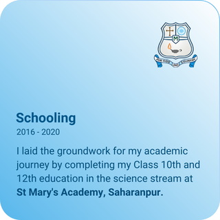

    
    
    
    
    
    
    
    
    
    
    
    
    

    
    
    

    
    
    

    
    
    

    

Profile may not look nice in dark theme or on mobile devices. Head on to desktop or till then check out [my portfolio](https://jindalujjwal0720.github.io/portfolio). It works everywhere.
